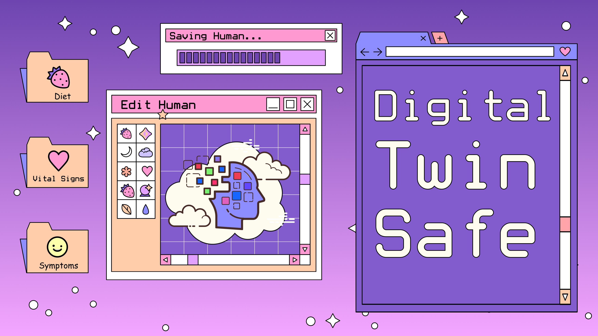

# Digital Twin Safe

Safely import and store all your data for training your digital twin AI agent to maximize your health and happiness.



# Digital Twins

A digital twin is the closest possible digital representation of your knowledge, values, and preferences. Ideally they will be able to help everyone create a better world by automating tasks, making decisions, and perfectly coordinating with 8 billion other digital twins.

- [The Benefits of 8 Billion Digital Twins](docs/why-digital-twins.md)
- [How to Create a Digital Twin](docs/how-to-build-a-digital-twin.md)
- [Digital Twin Safe](docs/digital-twin-safe.md)
  - [Site Map](docs/dts-site-map.md)
- [Data Sources](docs/digital-twin-data-sources.md)
- [Data Model](docs/digital-twin-data-model.md)


## Get Started

Clone this repo, navigate into the folder and launch the app with `pnpm`:

```bash
pnpm i && pnpm dev
```
## 2. Set up environment variables

To run this app, we'll need to set up the required environment variables.

To do that, convert the `.env.example` file that’s located at the root of the repo into a `.env` file.

Here are the set-up instructions for each of the environment variables:

1. `NEXT_PUBLIC_ROOT_DOMAIN`: This is the domain of your app (e.g. `vercel.app, okta.com,` `hashnode.dev` etc.)
2. `POSTGRES_PRISMA_URL, POSTGRES_URL_NON_POOLING`: [Follow the steps here](https://vercel.com/docs/storage/vercel-postgres/quickstart) to provision a Vercel Postgres instance. If you have already deployed the template, you can pull the env vars with the Vercel CLI by running `vc env pull` ([full docs here](https://vercel.com/docs/cli/env#exporting-development-environment-variables)).
3. `BLOB_READ_WRITE_TOKEN`: [Follow the steps here](https://vercel.com/docs/storage/blob/quickstart) to provision a Vercel Blob instance. If you have already deployed the template, you can pull the env vars with the Vercel CLI by running `vc env pull.`
4. `NEXTAUTH_SECRET, AUTH_GITHUB_ID` & `AUTH_GITHUB_SECRET`: These are the secrets required for GitHub OAuth and login via NextAuth.js. You can generate them [here](https://github-client-generator.vercel.app/) (caveat: the generator uses `AUTH_SECRET` instead of `NEXTAUTH_SECRET`, you'll have to change that accordingly).
5. `AUTH_BEARER_TOKEN`: This is your Vercel authentication token that can be found [here](https://vercel.com/account/tokens).
6. `PROJECT_ID_VERCEL`: This is your Vercel Project ID that can be found in your Vercel Project settings page (`https://vercel.com/<org>/<project>/settings`). Since you haven't deployed your project to Vercel yet, you can leave this blank for now but remember to come back to add this after you've completed Step 5.
7. `TEAM_ID_VERCEL`: This is your Vercel Team ID that can be found in your Vercel Team settings page (`https://vercel.com/<org>/settings`)
8. `OPENAI_API_KEY`: Required for AI text generation in the text editor. [Get one here](https://platform.openai.com/account/api-keys).

Note: When developing locally, don't forget to add the `NEXTAUTH_URL` environment variable in your `.env` file and set the value to `http://app.localhost:3000`. You won't need to do this in production since NextAuth automatically detects the URL from your Vercel environment.

## 3. Publish your Prisma Schema

The template comes pre-populated with the necessary Prisma schema for this app. All you need to do to publish this schema to your database is run the following command:

```bash
npx prisma db push
```

## 4. Update your NextAuth.js callback URLs

In step 2, we set up a GitHub app using the [GitHub Client Generator](https://github-client-generator.vercel.app/).

However, we still need to customize the callback URLs for the GitHub App in order for the OAuth process to work properly

First, go to [Developer Settings](https://github.com/settings/apps) on GitHub and click on the GitHub app that you created earlier. Then, under the "Identifying and authorizing users" section, add the following 2 callback URLs:

1. `http://app.localhost:3000/api/auth/callback/github`
2. `https://app.<YOURDOMAIN.COM>/api/auth/callback/github`
   

Save your changes, and you're all set! You can now go back to the app login page and log in with GitHub.


